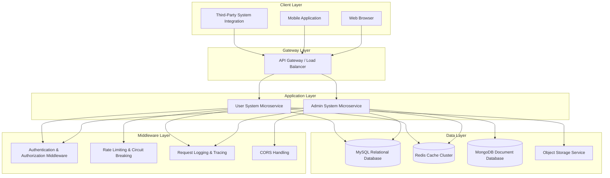

# MingHe

`MingHe` is an enterprise-grade full-stack web solution with frontend-backend separation, consisting of two core subsystems: the **MingHe Admin System** and the **MingHe User System**. Each subsystem is equipped with independent frontend applications and backend microservices, supporting independent deployment and horizontal scaling.

## Project Overview

MingHe is a comprehensive digital solution designed for enterprises and industrial park scenarios, providing end-to-end technical support for minghe management, enterprise services, talent service platforms, and other business scenarios. The system adopts a modern frontend-backend separation architecture, with the backend built on Golang + Gin high-performance web framework to provide RESTful API services, and the frontend built on Vue 3 + TypeScript + Element Plus technology stack to deliver modern user interfaces. Through Docker containerization, it enables flexible deployment and provides a stable and reliable technical foundation for business scenarios of varying scales.

**Core Value:**

- **Full-Stack Solution**: Provides complete frontend and backend code assets, covering full-link capabilities including user interaction, business logic, and data persistence, significantly reducing the R&D threshold for enterprise-grade applications
- **High-Performance Microservices Architecture**: Backend built with Gin framework delivers RESTful API services supporting high concurrency and low latency, combined with Redis caching and database optimization to ensure system performance in complex business scenarios
- **Modern Frontend Engineering**: Responsive user interfaces built on Vue 3 + TypeScript, integrated with Element Plus enterprise-grade UI component library, delivering smooth user experience and rich interaction capabilities
- **Refined Permission Control**: RBAC (Role-Based Access Control) implemented based on Casbin, complemented by a comprehensive audit logging system, meeting enterprise-level security and compliance requirements
- **Multi-Cloud Storage Adaptation**: Supports local storage and mainstream object storage services including Tencent COS, Aliyun OSS, MinIO, Huawei OBS, AWS S3, flexibly adapting to different infrastructure environments
- **Open API Ecosystem**: Integrates Swagger to automatically generate interactive API documentation, provides OpenAPI specification support, facilitating frontend development integration and third-party system integration

**Use Cases:**

- minghe Comprehensive Management System
- Enterprise Service Platform and SaaS Applications
- Talent Service and Recruitment Management System
- Campus Management and Digital Education Platform
- Other enterprise-grade applications requiring admin backends and user services

## Key Features

- **High-Performance Service Architecture**: RESTful API services built on Gin framework, supporting optimization mechanisms such as HTTP/2, connection pool reuse, middleware chaining, confidently handling high-concurrency access scenarios
- **Dual-System Independent Deployment**: Management system and user system are physically isolated, supporting independent scaling, canary releases, and fault isolation, ensuring high availability of core business
- **Multi-Database Compatibility**: Supports mainstream databases including MySQL, PostgreSQL, SQL Server, Oracle, MongoDB, SQLite, implementing unified data access layer through GORM ORM framework, reducing database migration costs
- **Elastic Storage Solutions**: Provides seamless switching capability between local file system storage and multi-cloud object storage, supports dynamic configuration of storage strategies, meeting storage requirements for different scale businesses
- **Enterprise-Grade Permission System**: Fine-grained RBAC permission control implemented based on Casbin engine, supports multi-dimensional permission management including users, roles, permissions, and menus, complemented by operation audit logs, meeting compliance requirements such as cybersecurity grading
- **Automated API Documentation**: Integrates Swagger/OpenAPI specification to automatically generate interactive API documentation, supports online debugging and interface testing, improving frontend-backend collaboration efficiency
- **Containerized Delivery Capability**: Provides complete Docker images and Docker Compose orchestration configurations, supports CI/CD automated pipeline integration, achieving one-click deployment and elastic scaling of applications
- **Structured Logging System**: Structured logging implemented based on Zap high-performance logging library, supports log classification, context tracing, asynchronous output, and other features, facilitating issue localization and performance analysis
- **Distributed Task Scheduling**: Integrates Cron scheduled task scheduler, supports advanced features such as task persistence, retry on failure, distributed locks, meeting scheduled business processing requirements
- **Intelligent Service Integration**: User system integrates Volcengine AI capabilities, providing intelligent services such as recommendation and natural language processing, enhancing platform intelligence
- **Multi-Channel Verification Services**: Integrates Tencent Cloud SMS service, providing multi-scenario verification code sending capabilities for registration, login, and security verification, ensuring user account security
- **Dependency Injection Architecture**: User system backend adopts Wire for compile-time dependency injection, reducing coupling between modules and improving code testability and maintainability

## Project Structure

```
x-MingHe/
├── admin/                    # MingHe Admin System
│   ├── server/                      # Backend Microservice (Golang + Gin)
│   │   ├── api/                     # RESTful API Controller Layer
│   │   │   └── v1/                  # API Version Control
│   │   ├── config/                  # Configuration Management & Environment Adaptation
│   │   ├── core/                    # Core Components & Infrastructure
│   │   ├── global/                  # Global Context & Singleton Management
│   │   ├── initialize/              # Application Initialization & Dependency Injection
│   │   ├── middleware/              # HTTP Middleware (Auth, Logging, Rate Limiting, etc.)
│   │   ├── model/                   # Domain Models & Data Transfer Objects
│   │   ├── plugin/                  # Plugin System (Announcement, Email, etc.)
│   │   ├── router/                  # Router Registration & API Gateway
│   │   ├── service/                 # Business Logic Layer
│   │   ├── utils/                   # Utility Libraries & Common Components
│   │   ├── task/                    # Scheduled Task Scheduling
│   │   ├── config.yaml              # Production Environment Configuration
│   │   ├── config_dev.yaml          # Development Environment Configuration
│   │   ├── Dockerfile               # Container Image Build File
│   │   ├── go.mod                   # Go Module Dependency Management
│   │   └── main.go                  # Application Entry Point
│   └── web/                         # Frontend SPA (Vue 3 + TypeScript)
│       ├── src/                     # Source Code Directory
│       ├── public/                  # Static Assets
│       ├── package.json             # NPM Dependency Configuration
│       ├── vite.config.ts           # Vite Build Configuration
│       └── tsconfig.json            # TypeScript Configuration
├── portal/                     # MingHe User System
│   ├── server/                      # Backend Microservice (Golang + Gin)
│   │   ├── cmd/                     # Command Line Interface & Application Entry
│   │   ├── internal/                # Internal Modules (Non-exported)
│   │   │   ├── app/                 # Application Lifecycle Management
│   │   │   ├── handler/             # HTTP Handlers & Request Routing
│   │   │   ├── service/             # Business Service Layer
│   │   │   ├── repository/          # Data Access Layer (Repository Pattern)
│   │   │   ├── middleware/          # Middleware Collection
│   │   │   ├── pkg/                 # Internal Utility Packages
│   │   │   ├── types/               # Type Definitions & Domain Models
│   │   │   ├── client/              # External Service Clients (SMS, AI, etc.)
│   │   │   └── infra/               # Infrastructure Abstractions
│   │   ├── docs/                    # Swagger API Documentation
│   │   ├── config.yaml              # Configuration File
│   │   ├── config_local.yaml        # Local Development Configuration
│   │   ├── config_dev.yaml          # Development Environment Configuration
│   │   ├── config_test.yaml         # Test Environment Configuration
│   │   ├── config_prod.yaml         # Production Environment Configuration
│   │   ├── Dockerfile               # Container Image Build File
│   │   ├── gorm_gen.tool            # GORM Code Generation Configuration
│   │   ├── go.mod                   # Go Module Dependency Management
│   │   └── wire.go                  # Wire Dependency Injection Configuration
│   └── web/                         # Frontend SPA (Vue 3 + TypeScript)
│       ├── src/                     # Source Code Directory
│       ├── public/                  # Static Assets
│       ├── package.json             # NPM Dependency Configuration
│       ├── vite.config.ts           # Vite Build Configuration
│       └── tsconfig.json            # TypeScript Configuration
├── README.md                        # Project Main Documentation (Chinese)
├── README.en.md                     # Project Main Documentation (English)
└── LICENSE                          # MIT Open Source License
```

## System Architecture

### System Layered Architecture



## Quick Start

### Requirements

#### Windows Environment
- **Go** 1.24+ (recommended 1.24.2 or higher)
- **Node.js** 16+ (frontend development environment, LTS version recommended)
- **MySQL** 8.0+ or **PostgreSQL** 12+ (relational database)
- **Redis** 6.0+ (optional, for caching and session management)
- **Git** (version control tool)
- **Docker** & **Docker Compose** (optional, for containerized deployment)

#### Linux Environment
- **Go** 1.24+ (recommended 1.24.2 or higher)
- **Node.js** 16+ (frontend development environment, LTS version recommended)
- **MySQL** 8.0+ or **PostgreSQL** 12+ (relational database)
- **Redis** 6.0+ (optional, for caching and session management)
- **Git** (version control tool)
- **Docker** & **Docker Compose** (optional, for containerized deployment)

### Clone Project

```bash
# Clone project via Gitee (recommended for China)
git clone https://gitee.com/cross-lang/x-MingHe.git
cd x-MingHe

# Or clone project via GitHub
git clone https://github.com/cross-lang/x-MingHe.git
cd x-MingHe
```

### Quick Deployment

For dependency installation, configuration setup, service startup, Docker deployment, and common development commands, please refer to the detailed documentation of each subproject:

- **[Admin System Backend Documentation](./admin/server/README.md)** - Contains complete deployment architecture, environment configuration, service startup, containerized deployment, and development guide for the admin system backend
- **[Admin System Frontend Documentation](./admin/web/README.md)** - Contains environment setup, dependency management, development debugging, production build, and deployment process for the admin system frontend
- **[User System Backend Documentation](./portal/server/README.md)** - Contains complete deployment architecture, environment configuration, service startup, containerized deployment, and development guide for the user system backend
- **[User System Frontend Documentation](./portal/web/README.md)** - Contains environment setup, dependency management, development debugging, production build, and deployment process for the user system frontend

## Technology Stack

### Backend Technology Stack

**Web Framework & Core Components**
- [Gin](https://gin-gonic.com/) - High-performance HTTP web framework based on Go, providing core capabilities including routing, middleware, and JSON validation
- [GORM](https://gorm.io/) - Go ORM library providing database abstraction layer and chainable query API
- [GORM Gen](https://gorm.io/gen/) - GORM code generator implementing type-safe database operations

**Databases & Caching**
- [MySQL](https://www.mysql.com/) - Mainstream relational database supporting enterprise-grade features such as transactions, indexes, and stored procedures
- [PostgreSQL](https://www.postgresql.org/) - Advanced open-source relational database supporting extended features like JSON and full-text search
- [MongoDB](https://www.mongodb.com/) - Document-type NoSQL database suitable for unstructured data storage
- [Redis](https://redis.io/) - In-memory data structure store used for caching, sessions, message queues, and other scenarios

**Utility Libraries & Middleware**
- [Zap](https://github.com/uber-go/zap) - Uber open-source high-performance structured logging library
- [Viper](https://github.com/spf13/viper) - Configuration file parsing library supporting multiple configuration formats
- [Casbin](https://casbin.org/) - Access control library supporting multiple permission models including RBAC and ABAC
- [JWT](https://github.com/golang-jwt/jwt) - JSON Web Token implementation for stateless authentication
- [Wire](https://github.com/google/wire) - Google open-source compile-time dependency injection code generator
- [Swagger](https://swagger.io/) / [Swaggo](https://github.com/swaggo/swag) - API documentation generation and interactive documentation
- [Cron](https://github.com/robfig/cron/v3) - Scheduled task scheduler supporting Cron expressions

**Deployment & Operations**
- [Docker](https://www.docker.com/) - Containerization platform enabling consistent application delivery across environments
- [Docker Compose](https://docs.docker.com/compose/) - Multi-container orchestration tool simplifying local development and deployment

### Frontend Technology Stack

**Core Frameworks**
- [Vue.js](https://vuejs.org/) 3.x - Progressive JavaScript framework providing reactive data binding and component-based development capabilities
- [TypeScript](https://www.typescriptlang.org/) - Superset of JavaScript providing static type checking and better development experience

**UI Component Libraries**
- [Element Plus](https://element-plus.org/) - Enterprise-grade UI component library based on Vue 3, providing rich business components

**Build Tools**
- [Vite](https://vitejs.dev/) - Next-generation frontend build tool providing fast cold start and hot module replacement

**State Management & Routing**
- [Pinia](https://pinia.vuejs.org/) - Officially recommended state management library for Vue 3
- [Vue Router](https://router.vuejs.org/) - Official router manager for Vue.js

## API Documentation

For API documentation access addresses, interface specifications, authentication methods, and usage examples of each subsystem, please refer to the documentation of the corresponding subproject:

- **[Admin System Backend Documentation](./admin/server/README.md)** - Contains Swagger UI interactive documentation, ReDoc read-only documentation, and OpenAPI JSON specification for the admin system, covering complete API collections including system management, permission control, and business customization
- **[User System Backend Documentation](./portal/server/README.md)** - Contains Swagger UI interactive documentation and OpenAPI JSON specification for the user system, covering core API interfaces including user authentication, enterprise association, and identity verification

## Storage Configuration

For configuration instructions, best practices, and migration guides for local file system storage and multi-cloud object storage, please refer to the documentation of the corresponding subproject:

- **[Admin System Backend Documentation](./admin/server/README.md)** - Detailed explanation of configuration parameters, connection optimization, and fault tolerance strategies for local storage, Tencent COS, Aliyun OSS, MinIO, Huawei OBS, AWS S3, and other storage services
- **[User System Backend Documentation](./portal/server/README.md)** - Explanation of integration methods, configuration items, and usage examples for Tencent COS and other storage services

## Subproject Documentation

Detailed technical documentation, architecture design, development standards, and deployment guides for each subproject:

- **[Admin System Backend Documentation](./admin/server/README.md)** - Technical architecture, API design, database design, deployment guide
- **[Admin System Frontend Documentation](./admin/web/README.md)** - Component architecture, state management, style specifications, build and deployment
- **[User System Backend Documentation](./portal/server/README.md)** - Technical architecture, API design, database design, deployment guide
- **[User System Frontend Documentation](./portal/web/README.md)** - Component architecture, state management, style specifications, build and deployment

## License

This project is licensed under the [MIT Open Source License](./LICENSE), permitting commercial use, modification, distribution, and private use, provided that copyright notices and license statements are retained.

## References

**Official Documentation & Community Resources**
- [Gin Framework Official Documentation](https://gin-gonic.com/docs/) - Complete usage guide for Gin framework
- [GORM ORM Official Documentation](https://gorm.io/docs/) - GORM database operation guide
- [Go Language Official Documentation](https://golang.org/doc/) - Go language programming guide
- [Vue.js Official Documentation](https://vuejs.org/guide/) - Complete Vue.js framework documentation
- [TypeScript Official Documentation](https://www.typescriptlang.org/docs/) - TypeScript language specification and usage guide
- [gin-vue-admin Official Documentation](https://gin-vue-admin.com/) - gin-vue-admin project documentation
- [Swagger / OpenAPI Specification](https://swagger.io/specification/) - API design specification and best practices
- [Docker Official Documentation](https://docs.docker.com/) - Complete guide to containerization technology

## Contact

- **Author**: John Young
- **Email**: john.young@foxmail.com
- **Gitee Repository**: https://gitee.com/yeyushilai
- **GitHub Repository**: https://github.com/yeyushilai
