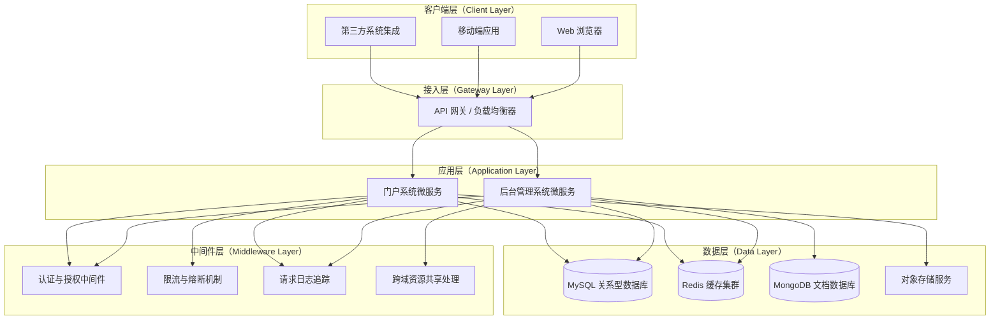

# 明河（MingHe）

> 八月凉风天气晶，
> 万里无云河汉明，
> 昏见南楼清且浅，
> 晓落西山纵复横。
> —— 宋之问《明河篇》

---

`明河（MingHe）`是一套前后端分离的企业级 Web 全栈解决方案，由**明河（MingHe）后台管理系统**和**明河（MingHe）门户系统**两大核心子系统构成，每个子系统均配备独立的前端应用与后端微服务，支持独立部署与横向扩展。

## 项目简介

明河（MingHe）是一套面向企业与园区场景的综合数字化解决方案，为智慧园区管理、企业服务、人才服务平台等业务场景提供端到端的技术支撑。系统采用现代化前后端分离架构，后端基于 Golang + Gin 高性能 Web 框架构建 RESTful API 服务，前端采用 Vue 3 + TypeScript + Element Plus 技术栈打造现代化用户界面，通过 Docker 容器化实现灵活部署，为不同规模的业务场景提供稳定可靠的技术底座。

**核心价值：**

- **全栈解决方案**：提供完整的前后端代码资产，涵盖用户交互、业务逻辑、数据持久化等全链路能力，大幅降低企业级应用研发门槛
- **高性能微服务架构**：后端采用 Gin 框架构建，支持高并发、低延迟的 API 服务，结合 Redis 缓存与数据库优化，保障系统在复杂业务场景下的性能表现
- **现代化前端工程**：基于 Vue 3 + TypeScript 构建响应式用户界面，集成 Element Plus 企业级 UI 组件库，提供流畅的用户体验与丰富的交互能力
- **精细化权限管控**：基于 Casbin 实现基于角色的访问控制（RBAC），配合完善的审计日志体系，满足企业级安全合规要求
- **多云存储适配**：支持本地存储及腾讯云 COS、阿里云 OSS、MinIO、华为云 OBS、AWS S3 等主流对象存储服务，灵活适配不同基础设施环境
- **开放 API 生态**：集成 Swagger 自动生成交互式 API 文档，提供 OpenAPI 规范支持，便于前端开发对接与第三方系统集成

**适用场景：**

- 智慧园区综合后台管理系统
- 企业服务平台与 SaaS 应用
- 人才服务与招聘后台管理系统
- 校园管理与数字化教育平台
- 其他需要管理后台与用户服务的企业级应用

## 核心特征

- **高性能服务架构**：基于 Gin 框架构建的 RESTful API 服务，支持 HTTP/2、连接池复用、中间件链式处理等优化机制，从容应对高并发访问场景
- **双系统独立部署**：后台管理系统与门户系统物理隔离，支持独立扩容、灰度发布与故障隔离，保障核心业务的高可用性
- **多数据库兼容**：支持 MySQL、PostgreSQL、SQL Server、Oracle、MongoDB、SQLite 等主流数据库，通过 GORM ORM 框架实现统一的数据访问层，降低数据库迁移成本
- **弹性存储方案**：提供本地文件系统存储与多云对象存储的无缝切换能力，支持存储策略动态配置，满足不同规模业务的存储需求
- **企业级权限体系**：基于 Casbin 引擎实现细粒度的 RBAC 权限控制，支持用户、角色、权限、菜单等多维度权限管理，配合操作审计日志，满足等保合规要求
- **自动化 API 文档**：集成 Swagger/OpenAPI 规范，自动生成交互式 API 文档，支持在线调试与接口测试，提升前后端协作效率
- **容器化交付能力**：提供完整的 Docker 镜像与 Docker Compose 编排配置，支持 CI/CD 自动化流水线集成，实现应用的一键部署与弹性伸缩
- **结构化日志系统**：基于 Zap 高性能日志库实现结构化日志记录，支持日志分级、上下文追踪、异步输出等特性，便于问题定位与性能分析
- **分布式任务调度**：集成 Cron 定时任务调度器，支持任务持久化、失败重试、分布式锁等高级特性，满足定时业务处理需求
- **智能化服务集成**：门户系统集成火山引擎 AI 能力，提供智能推荐、自然语言处理等 AI 服务，增强平台智能化水平
- **多通道验证服务**：集成腾讯云短信服务，提供注册、登录、安全验证等多场景验证码发送能力，保障用户账户安全
- **依赖注入架构**：门户系统后端采用 Wire 实现编译时依赖注入，降低模块间耦合度，提升代码可测试性与可维护性

## 项目结构

```
x-MingHe/
├── admin/                    # 明河后台管理系统
│   ├── server/                      # 后端微服务（Golang + Gin）
│   │   ├── api/                     # RESTful API 控制器层
│   │   │   └── v1/                  # API 版本控制
│   │   ├── config/                  # 配置管理与环境适配
│   │   ├── core/                    # 核心组件与基础设施
│   │   ├── global/                  # 全局上下文与单例管理
│   │   ├── initialize/              # 应用初始化与依赖注入
│   │   ├── middleware/              # HTTP 中间件（认证、日志、限流等）
│   │   ├── model/                   # 领域模型与数据传输对象
│   │   ├── plugin/                  # 插件系统（公告、邮件等）
│   │   ├── router/                  # 路由注册与 API 网关
│   │   ├── service/                 # 业务逻辑层
│   │   ├── utils/                   # 工具库与公共组件
│   │   ├── task/                    # 定时任务调度
│   │   ├── config.yaml              # 生产环境配置
│   │   ├── config_dev.yaml          # 开发环境配置
│   │   ├── Dockerfile               # 容器镜像构建文件
│   │   ├── go.mod                   # Go 模块依赖管理
│   │   └── main.go                  # 应用入口点
│   └── web/                         # 前端单页应用（Vue 3 + TypeScript）
│       ├── src/                     # 源代码目录
│       ├── public/                  # 静态资源
│       ├── package.json             # NPM 依赖配置
│       ├── vite.config.ts           # Vite 构建配置
│       └── tsconfig.json            # TypeScript 配置
├── portal/                     # 明河门户系统
│   ├── server/                      # 后端微服务（Golang + Gin）
│   │   ├── cmd/                     # 命令行接口与应用入口
│   │   ├── internal/                # 内部模块（非导出）
│   │   │   ├── app/                 # 应用生命周期管理
│   │   │   ├── handler/             # HTTP 处理器与请求路由
│   │   │   ├── service/             # 业务服务层
│   │   │   ├── repository/          # 数据访问层（Repository 模式）
│   │   │   ├── middleware/          # 中间件集合
│   │   │   ├── pkg/                 # 内部工具包
│   │   │   ├── types/               # 类型定义与领域模型
│   │   │   ├── client/              # 外部服务客户端（短信、AI 等）
│   │   │   └── infra/               # 基础设施抽象
│   │   ├── docs/                    # Swagger API 文档
│   │   ├── config.yaml              # 配置文件
│   │   ├── config_local.yaml        # 本地开发配置
│   │   ├── config_dev.yaml          # 开发环境配置
│   │   ├── config_test.yaml         # 测试环境配置
│   │   ├── config_prod.yaml         # 生产环境配置
│   │   ├── Dockerfile               # 容器镜像构建文件
│   │   ├── gorm_gen.tool            # GORM 代码生成配置
│   │   ├── go.mod                   # Go 模块依赖管理
│   │   └── wire.go                  # Wire 依赖注入配置
│   └── web/                         # 前端单页应用（Vue 3 + TypeScript）
│       ├── src/                     # 源代码目录
│       ├── public/                  # 静态资源
│       ├── package.json             # NPM 依赖配置
│       ├── vite.config.ts           # Vite 构建配置
│       └── tsconfig.json            # TypeScript 配置
├── README.md                        # 项目主文档（中文）
├── README.en.md                     # 项目主文档（英文）
└── LICENSE                          # MIT 开源许可证
```

## 系统架构

### 系统分层架构



## 快速开始

### 环境要求

#### Windows 环境
- **Go** 1.24+（推荐使用 1.24.2 或更高版本）
- **Node.js** 16+（前端开发环境，推荐使用 LTS 版本）
- **MySQL** 8.0+ 或 **PostgreSQL** 12+（关系型数据库）
- **Redis** 6.0+（可选，用于缓存与会话管理）
- **Git**（版本控制工具）
- **Docker** & **Docker Compose**（可选，用于容器化部署）

#### Linux 环境
- **Go** 1.24+（推荐使用 1.24.2 或更高版本）
- **Node.js** 16+（前端开发环境，推荐使用 LTS 版本）
- **MySQL** 8.0+ 或 **PostgreSQL** 12+（关系型数据库）
- **Redis** 6.0+（可选，用于缓存与会话管理）
- **Git**（版本控制工具）
- **Docker** & **Docker Compose**（可选，用于容器化部署）

### 项目克隆

```bash
# 通过 Gitee 克隆项目（国内推荐）
git clone https://gitee.com/cross-lang/x-MingHe.git
cd x-MingHe

# 或通过 GitHub 克隆项目
git clone https://github.com/cross-lang/x-MingHe.git
cd x-MingHe
```

### 快速部署

关于依赖安装、配置文件创建、服务启动、Docker 部署以及常用开发命令，请查看对应子项目的详细文档：

- **[后台管理系统后端文档](./admin/server/README.md)** - 包含后台管理系统后端的完整部署架构、环境配置、服务启动、容器化部署及开发指南
- **[后台管理系统前端文档](./admin/web/README.md)** - 包含后台管理系统前端的环境搭建、依赖管理、开发调试、生产构建及部署流程
- **[门户系统后端文档](./portal/server/README.md)** - 包含门户系统后端的完整部署架构、环境配置、服务启动、容器化部署及开发指南
- **[门户系统前端文档](./portal/web/README.md)** - 包含门户系统前端的环境搭建、依赖管理、开发调试、生产构建及部署流程

## 技术栈

### 后端技术栈

**Web 框架与核心组件**
- [Gin](https://gin-gonic.com/) - 基于 Go 语言的高性能 HTTP Web 框架，提供路由、中间件、JSON 验证等核心能力
- [GORM](https://gorm.io/) - Go 语言 ORM 库，提供数据库抽象层与链式查询 API
- [GORM Gen](https://gorm.io/gen/) - GORM 代码生成器，实现类型安全的数据库操作

**数据库与缓存**
- [MySQL](https://www.mysql.com/) - 主流关系型数据库，支持事务、索引、存储过程等企业级特性
- [PostgreSQL](https://www.postgresql.org/) - 高级开源关系型数据库，支持 JSON、全文检索等扩展特性
- [MongoDB](https://www.mongodb.com/) - 文档型 NoSQL 数据库，适用于非结构化数据存储
- [Redis](https://redis.io/) - 内存数据结构存储，用于缓存、会话、消息队列等场景

**工具库与中间件**
- [Zap](https://github.com/uber-go/zap) - Uber 开源的高性能结构化日志库
- [Viper](https://github.com/spf13/viper) - 配置文件解析库，支持多种配置格式
- [Casbin](https://casbin.org/) - 访问控制库，支持 RBAC、ABAC 等多种权限模型
- [JWT](https://github.com/golang-jwt/jwt) - JSON Web Token 实现，用于无状态认证
- [Wire](https://github.com/google/wire) - Google 开源的编译时依赖注入代码生成器
- [Swagger](https://swagger.io/) / [Swaggo](https://github.com/swaggo/swag) - API 文档生成与交互式文档
- [Cron](https://github.com/robfig/cron/v3) - 定时任务调度器，支持 Cron 表达式

**部署与运维**
- [Docker](https://www.docker.com/) - 容器化平台，实现应用的环境一致性交付
- [Docker Compose](https://docs.docker.com/compose/) - 多容器编排工具，简化本地开发与部署

### 前端技术栈

**核心框架**
- [Vue.js](https://vuejs.org/) 3.x - 渐进式 JavaScript 框架，提供响应式数据绑定与组件化开发能力
- [TypeScript](https://www.typescriptlang.org/) - JavaScript 的超集，提供静态类型检查与更好的开发体验

**UI 组件库**
- [Element Plus](https://element-plus.org/) - 基于 Vue 3 的企业级 UI 组件库，提供丰富的业务组件

**构建工具**
- [Vite](https://vitejs.dev/) - 下一代前端构建工具，提供极速的冷启动与热更新

**状态管理与路由**
- [Pinia](https://pinia.vuejs.org/) - Vue 3 官方推荐的状态管理库
- [Vue Router](https://router.vuejs.org/) - Vue.js 官方路由管理器

## API 文档

关于各子系统的 API 文档访问地址、接口规范、认证方式及使用示例，请查看对应子项目的文档：

- **[后台管理系统后端文档](./admin/server/README.md)** - 包含后台管理系统的 Swagger UI 交互式文档、ReDoc 只读文档及 OpenAPI JSON 规范，涵盖系统管理、权限控制、业务定制等完整 API 集合
- **[门户系统后端文档](./portal/server/README.md)** - 包含门户系统的 Swagger UI 交互式文档及 OpenAPI JSON 规范，涵盖用户认证、企业关联、实名验证等核心 API 接口

## 存储配置

关于本地文件系统存储与多云对象存储的配置说明、最佳实践及迁移指南，请查看对应子项目的文档：

- **[后台管理系统后端文档](./admin/server/README.md)** - 详细说明本地存储、腾讯云 COS、阿里云 OSS、MinIO、华为云 OBS、AWS S3 等存储服务的配置参数、连接优化及容错策略
- **[门户系统后端文档](./portal/server/README.md)** - 说明腾讯云 COS 等存储服务的集成方式、配置项说明及使用示例

## 子项目文档

各子项目的详细技术文档、架构设计、开发规范及部署指南：

- **[后台管理系统后端文档](./admin/server/README.md)** - 技术架构、API 设计、数据库设计、部署指南
- **[后台管理系统前端文档](./admin/web/README.md)** - 组件架构、状态管理、样式规范、构建部署
- **[门户系统后端文档](./portal/server/README.md)** - 技术架构、API 设计、数据库设计、部署指南
- **[门户系统前端文档](./portal/web/README.md)** - 组件架构、状态管理、样式规范、构建部署

## 许可证

本项目采用 [MIT 开源许可证](./LICENSE)，允许商业使用、修改、分发与私有使用，但需保留版权声明与许可证声明。

## 参考资料

**官方文档与社区资源**
- [Gin 框架官方文档](https://gin-gonic.com/docs/) - Gin 框架完整使用指南
- [GORM ORM 官方文档](https://gorm.io/docs/) - GORM 数据库操作指南
- [Go 语言官方文档](https://golang.org/doc/) - Go 语言编程指南
- [Vue.js 官方文档](https://vuejs.org/guide/) - Vue.js 框架完整文档
- [TypeScript 官方文档](https://www.typescriptlang.org/docs/) - TypeScript 语言规范与使用指南
- [gin-vue-admin 官方文档](https://gin-vue-admin.com/) - gin-vue-admin 项目文档
- [Swagger / OpenAPI 规范](https://swagger.io/specification/) - API 设计规范与最佳实践
- [Docker 官方文档](https://docs.docker.com/) - 容器化技术完整指南

## 联系方式

- **作者**: John Young
- **电子邮箱**: john.young@foxmail.com
- **Gitee 仓库**: https://gitee.com/yeyushilai
- **GitHub 仓库**: https://github.com/yeyushilai
