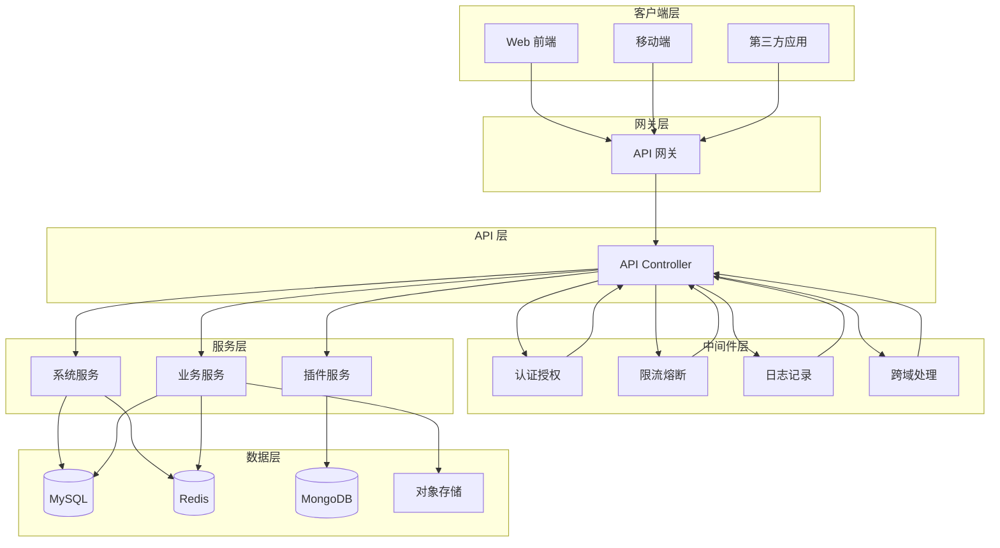
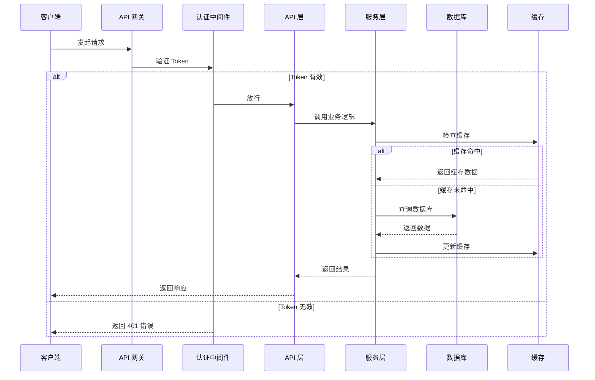
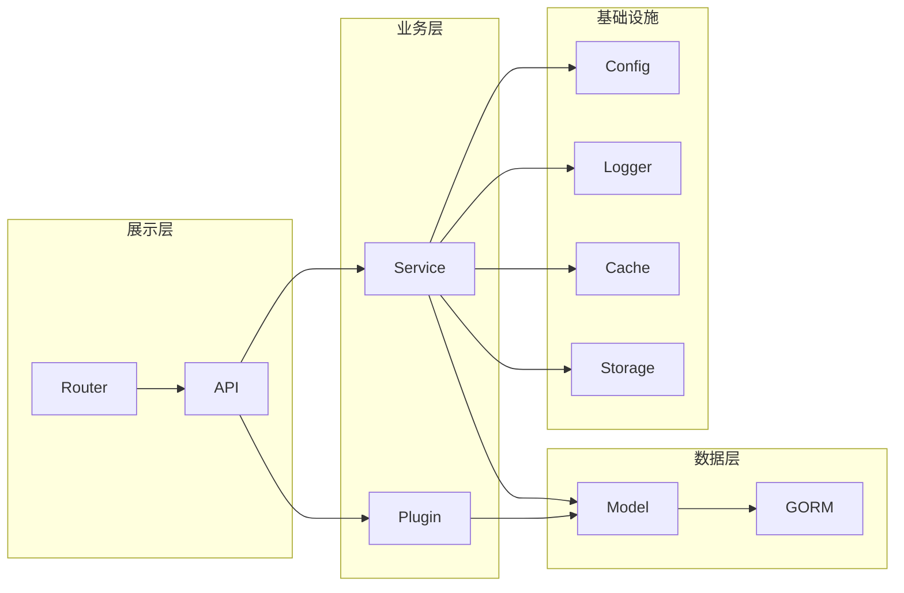

# 明河（MingHe）后台管理系统后端

## 项目简介

`明河（MingHe）后台管理系统后端`是一个基于 [gin-vue-admin](https://github.com/flipped-aurora/gin-vue-admin) 开源项目开发的现代化后台管理系统后端。采用 Golang + Gin 框架构建，提供高性能、高可用的 RESTful API 服务，适用于企业级管理后台、园区后台管理系统、人才服务平台等多种业务场景。

**核心价值：**
- 开箱即用的企业级架构，快速搭建后台管理系统
- 基于 Gin 的高性能 Web 框架，支持高并发场景
- 完善的权限控制（RBAC）和审计日志
- 支持多种数据库（MySQL、PostgreSQL、SQL Server、Oracle、MongoDB 等）
- 内置对象存储支持（腾讯云 COS、阿里云 OSS、MinIO 等）
- 完整的 API 文档自动生成（Swagger）

## 核心特征

- **高性能架构**：基于 Gin 框架，支持高并发场景
- **多数据库支持**：MySQL、PostgreSQL、SQL Server、Oracle、MongoDB、SQLite
- **灵活的存储方案**：本地存储、腾讯云 COS、阿里云 OSS、MinIO、华为云 OBS、AWS S3
- **完善的权限体系**：基于 Casbin 的 RBAC 权限控制
- **API 文档自动化**：集成 Swagger，自动生成交互式 API 文档
- **代码生成器**：支持快速生成 CRUD 代码
- **插件化设计**：支持自定义插件扩展业务功能
- **容器化部署**：支持 Docker 和 Docker Compose 部署
- **完善的日志系统**：基于 Zap 的高性能日志记录
- **定时任务支持**：内置 Cron 定时任务调度

## 项目结构

```
server/
├── api/                      # API 层
│   └── v1/
│       ├── custom/           # 业务定制接口
│       │   ├── enterprise.go # 企业管理接口
│       │   ├── user.go       # 用户管理接口
│       │   └── ...
│       ├── example/          # 示例接口
│       └── system/           # 系统接口
├── config/                   # 配置文件相关
├── constant/                 # 常量定义
├── core/                     # 核心组件
│   └── internal/             # 核心内部实现
├── deploy/                   # 部署脚本
│   └── deploy.sh            # 部署脚本
├── docs/                     # Swagger 文档
├── global/                   # 全局变量
├── initialize/               # 初始化
│   └── internal/            # 初始化内部函数
├── mcp/                      # MCP 协议相关
├── middleware/               # 中间件
├── model/                    # 模型层
│   ├── common/              # 通用模型
│   │   ├── request/         # 请求参数
│   │   └── response/        # 响应参数
│   ├── custom/              # 业务定制模型
│   ├── example/             # 示例模型
│   └── system/              # 系统模型
├── plugin/                   # 插件系统
│   ├── announcement/        # 公告插件
│   └── email/               # 邮件插件
├── resource/                 # 静态资源
│   ├── excel/               # Excel 模板
│   ├── page/                # 前端页面
│   └── template/            # 代码生成器模板
├── router/                   # 路由层
│   └── custom/              # 业务定制路由
├── service/                  # 服务层（业务逻辑）
├── source/                   # 初始化数据
├── task/                     # 定时任务
├── utils/                    # 工具包
│   ├── timer/               # 定时器
│   └── upload/              # 上传工具
├── Dockerfile                # Docker 镜像构建文件
├── build.sh                  # 构建脚本
├── config.yaml               # 生产环境配置
├── config_dev.yaml           # 开发环境配置
├── .env                      # 环境变量
├── go.mod                    # Go 模块定义
├── go.sum                    # Go 依赖校验
├── gorm_gen.tool             # GORM 代码生成配置
└── main.go                   # 程序入口
```

## 系统架构

### 系统分层架构



### 核心功能业务流程



### 模块依赖关系



## 快速开始

### 环境要求

#### Windows
- Go 1.24+（推荐使用 1.24.2）
- MySQL 8.0+ 或 PostgreSQL 12+
- Redis 6.0+（可选）
- Git

#### Linux
- Go 1.24+
- MySQL 8.0+ 或 PostgreSQL 12+
- Redis 6.0+（可选）
- Git

### 项目克隆

```bash
git clone https://gitee.com/cross-lang/x-MingHe.git
cd x-MingHe/admin/server
```

### 依赖安装

```bash
# 设置 Go 环境变量
go env -w GO111MODULE=on
go env -w GOPROXY=https://goproxy.cn,direct

# 安装依赖
go mod tidy
go mod download
```

### 配置文件创建

1. 复制配置文件模板：
```bash
cp config_dev.yaml config.yaml
```

2. 编辑 `config.yaml`，修改以下关键配置项：

```yaml
# 数据库配置
mysql:
  path: 127.0.0.1        # 数据库地址
  port: "3306"            # 数据库端口
  db-name: minghe         # 数据库名称
  username: root          # 数据库用户名
  password: "123456"      # 数据库密码
  config: charset=utf8mb4&parseTime=True&loc=Local

# Redis 配置（可选）
redis:
  addr: 127.0.0.1:6379
  password: ""
  db: 0

# 系统配置
system:
  addr: 8888              # 服务端口
  db-type: mysql         # 数据库类型
  oss-type: tencent-cos  # 对象存储类型

# JWT 配置
jwt:
  signing-key: da00267d-f28e-4554-b9cc-bf658f2b098e  # 签名密钥，请修改为随机字符串
  expires-time: 7d      # 过期时间
  buffer-time: 1d       # 缓冲时间

# 对象存储配置（以腾讯云 COS 为例）
tencent-cos:
  bucket: your-bucket-name
  region: ap-wuhan
  secret-id: your-secret-id
  secret-key: your-secret-key
  base-url: https://your-bucket-url
  path-prefix: upload
```

### 服务启动

#### 本地启动

```bash
# 生成 Swagger 文档
swag init -g main.go -o docs

# 启动服务
go run . -c config.yaml
```

#### Docker 启动

```bash
# 构建镜像
docker build -t minghe-admin-server:latest .

# 启动容器
docker run -d \
  --name minghe-server \
  -p 8888:8888 \
  -v $(pwd)/config.yaml:/app/config.yaml \
  -v $(pwd)/resource:/app/resource \
  -v $(pwd)/log:/app/log \
  minghe-admin-server:latest

# 或使用部署脚本（支持多环境）
./build.sh dev    # 开发环境
./build.sh test   # 测试环境
./build.sh prod   # 生产环境
```

### 常用命令

```bash
# 生成 Swagger 文档
swag init -g main.go -o docs

# 运行服务
go run . -c config.yaml

# 构建二进制文件
go build -o server .

# 运行测试
go test ./...

# 格式化代码
go fmt ./...

# 代码检查
go vet ./...

# 数据库模型生成（修改数据库结构后执行）
gentool -c "./gorm_gen.tool"

# 快捷调试（生成文档 + 启动服务）
gentool -c "./gorm_gen.tool" && swag init -g main.go -o docs && go run . -c config.yaml
```

## 技术栈

### Web 框架
- [Gin](https://gin-gonic.com/) - 高性能 HTTP Web 框架
- [GORM](https://gorm.io/) - ORM 数据库操作库
- [Swagger](https://swagger.io/) - API 文档生成

### 数据存储
- [MySQL](https://www.mysql.com/) - 关系型数据库
- [PostgreSQL](https://www.postgresql.org/) - 关系型数据库
- [MongoDB](https://www.mongodb.com/) - 文档型数据库
- [Redis](https://redis.io/) - 缓存数据库

### 工具库
- [Zap](https://github.com/uber-go/zap) - 高性能日志库
- [Viper](https://github.com/spf13/viper) - 配置文件解析
- [Casbin](https://casbin.org/) - 权限控制
- [JWT](https://github.com/golang-jwt/jwt) - JSON Web Token
- [Cron](https://github.com/robfig/cron) - 定时任务

### 部署工具
- [Docker](https://www.docker.com/) - 容器化部署
- [Docker Compose](https://docs.docker.com/compose/) - 多容器编排

## API 文档

启动服务后，可通过以下地址访问 API 文档：

- **Swagger UI**（交互式 API 文档）: http://localhost:8888/swagger/index.html
- **ReDoc**（只读 API 文档）: http://localhost:8888/swagger/doc/
- **OpenAPI JSON**（OpenAPI 规范）: http://localhost:8888/swagger/doc.json

主要 API 分类：
- `/system` - 系统管理接口（用户、角色、权限、菜单等）
- `/custom` - 业务定制接口（企业、用户、公告等）
- `/example` - 示例接口

## 存储配置

### 本地存储

```yaml
local:
  path: uploads/file        # 存储路径
  store-path: uploads/file   # 挂载路径
```

### 对象存储

支持多种对象存储服务，可根据需要选择：

#### 腾讯云 COS
```yaml
tencent-cos:
  bucket: your-bucket-name
  region: ap-wuhan
  secret-id: your-secret-id
  secret-key: your-secret-key
  base-url: https://your-bucket-url.cos.ap-wuhan.myqcloud.com
  path-prefix: upload
```

#### 阿里云 OSS
```yaml
aliyun-oss:
  endpoint: yourEndpoint
  access-key-id: yourAccessKeyId
  access-key-secret: yourAccessKeySecret
  bucket-name: yourBucketName
  bucket-url: yourBucketUrl
  base-path: yourBasePath
```

#### MinIO
```yaml
minio:
  endpoint: your-minio-endpoint
  access-key-id: yourAccessKeyId
  access-key-secret: yourAccessKeySecret
  bucket-name: yourBucketName
  use-ssl: false
  base-path: yourBasePath
  bucket-url: yourBucketUrl
```

#### 华为云 OBS
```yaml
hua-wei-obs:
  path: you-path
  bucket: you-bucket
  endpoint: you-endpoint
  access-key: you-access-key
  secret-key: you-secret-key
```

## 许可证

本项目采用 [LICENSE](../LICENSE) 许可证。

## 参考资料

- [Gin 官方文档](https://gin-gonic.com/docs/)
- [GORM 官方文档](https://gorm.io/docs/)
- [Golang 官方文档](https://golang.org/doc/)
- [gin-vue-admin 官方文档](https://gin-vue-admin.com/)
- [gin-vue-admin GitHub 仓库](https://github.com/flipped-aurora/gin-vue-admin)
- [Swagger 规范](https://swagger.io/specification/)

## 联系方式

- **作者**: John Young
- **邮箱**: john.young@foxmail.com
- **Gitee**: https://gitee.com/yeyushilai
- **GitHub**: https://github.com/yeyushilai
