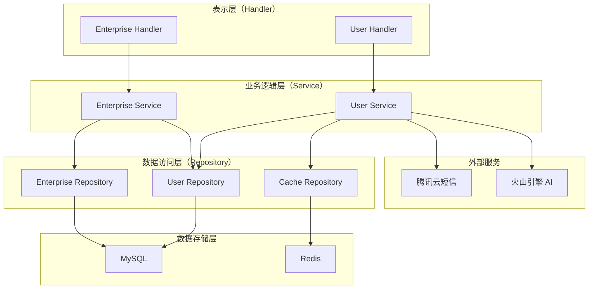
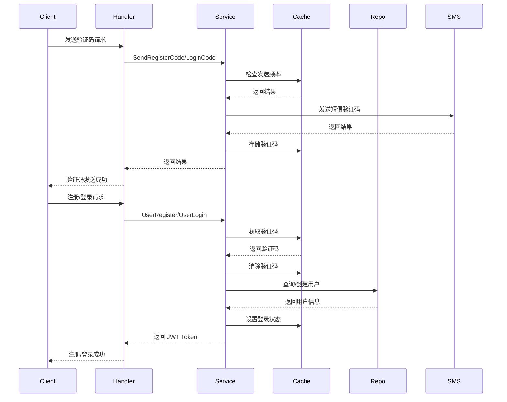
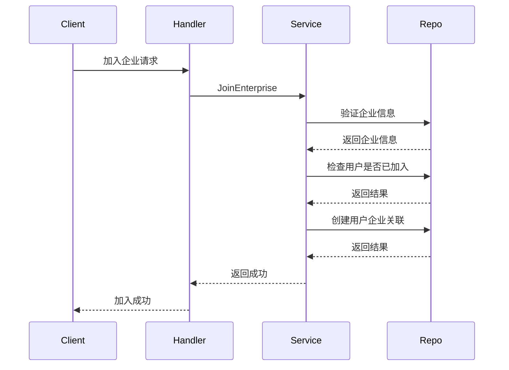
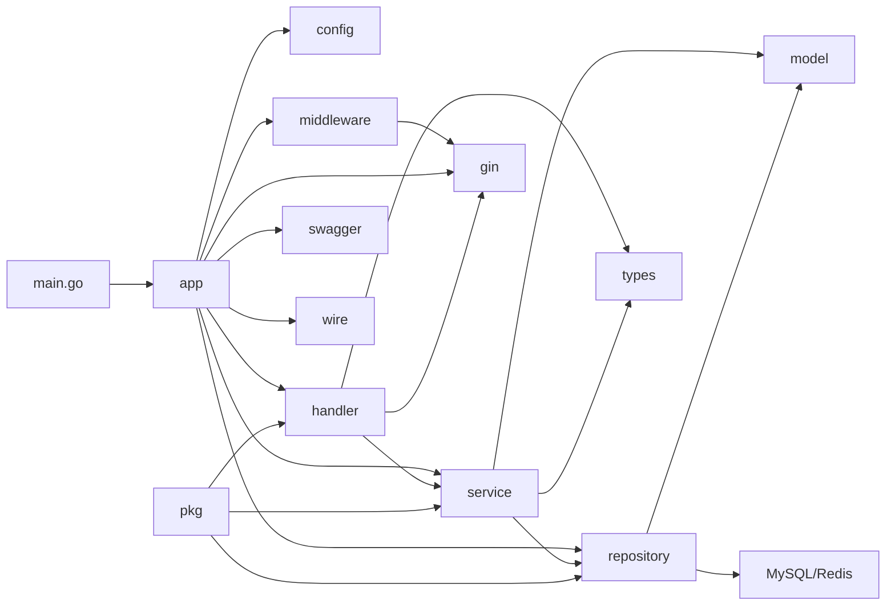

# 明河（MingHe）门户系统后端

## 项目简介

`明河（MingHe）门户系统后端`是一个基于 Go 语言开发的现代化用户后台管理系统，提供用户注册、登录、实名认证、企业管理、用户注销等核心功能。系统采用分层架构设计，支持多环境部署，适用于智慧园区、企业服务、校园管理等场景。

## 核心特征

- **高性能 Web 服务**：基于 Gin 框架构建，提供高效的 HTTP 请求处理能力
- **安全认证机制**：集成 JWT 认证和用户登录状态管理，支持多种用户角色
- **短信验证服务**：集成腾讯云短信服务，提供注册和登录验证码发送
- **分布式缓存**：使用 Redis 实现缓存管理和请求限流
- **数据持久化**：基于 MySQL + GORM 的可靠数据存储方案
- **自动化文档**：集成 Swagger 自动生成交互式 API 文档
- **依赖注入**：使用 Wire 实现松耦合的依赖管理
- **容器化部署**：支持 Docker 容器化部署和多环境配置
- **AI 能力集成**：集成火山引擎知识库和模型服务

## 项目结构

```
server/
├── cmd/
│   └── server/              # 应用入口
│       ├── main.go          # 主程序入口
│       ├── wire.go          # Wire 依赖注入配置
│       └── wire_gen.go      # Wire 自动生成代码
├── internal/
│   ├── app/                 # 应用核心层
│   │   ├── app.go           # 应用初始化
│   │   ├── container.go     # DI 容器定义
│   │   ├── router.go        # 路由注册
│   │   ├── swagger.go       # Swagger 文档配置
│   │   ├── migrate.go       # 数据库迁移
│   │   └── task.go          # 定时任务
│   ├── config/              # 配置管理
│   │   └── config.go        # 配置加载和解析
│   ├── constant/            # 常量定义
│   │   └── common.go        # 通用常量
│   ├── handler/             # HTTP 处理器层
│   │   ├── enterprise/      # 企业模块处理器
│   │   └── user/            # 用户模块处理器
│   ├── service/             # 业务逻辑层
│   │   ├── enterprise/      # 企业业务逻辑
│   │   └── user/            # 用户业务逻辑
│   ├── repository/          # 数据访问层
│   │   ├── cache.go         # Redis 缓存操作
│   │   ├── user_repo.go     # 用户数据操作
│   │   ├── enterprise_repo.go  # 企业数据操作
│   │   ├── user_enterprise_repo.go  # 用户企业关联操作
│   │   └── provider.go      # Repository 提供者
│   ├── model/               # 数据模型（GORM Gen 生成）
│   │   ├── x_user.gen.go                # 用户模型
│   │   ├── x_enterprise.gen.go         # 企业模型
│   │   ├── x_user_enterprise.gen.go     # 用户企业关联模型
│   │   └── x_user_identity_verification.gen.go  # 用户实名认证模型
│   ├── middleware/          # 中间件
│   │   ├── cors.go          # 跨域处理
│   │   ├── logger.go        # 请求日志记录
│   │   ├── login_auth.go    # 登录认证中间件
│   │   ├── ratelimit.go     # 限流中间件
│   │   ├── recovery.go      # 异常恢复中间件
│   │   └── trace.go         # 请求追踪中间件
│   ├── pkg/                 # 通用工具包
│   │   ├── context.go       # 上下文工具
│   │   ├── encrypt/         # 加密工具（AES、3DES）
│   │   ├── errorx/          # 错误处理
│   │   ├── ginx/            # Gin 辅助工具
│   │   ├── gormx/           # GORM 辅助工具
│   │   ├── log/             # 日志工具
│   │   ├── stringx/         # 字符串工具
│   │   └── timex/           # 时间工具
│   ├── types/               # 类型定义
│   │   ├── user.go          # 用户相关类型
│   │   └── enterprise.go    # 企业相关类型
│   ├── client/               # 外部客户端
│   │   ├── http/            # HTTP 客户端（FastHTTP）
│   │   └── sms/             # 短信客户端
│   └── infra/               # 基础设施
│       ├── mysql.go         # MySQL 配置
│       └── redis.go         # Redis 配置
├── docs/                    # API 文档
│   ├── docs.go              # Swagger 生成的文档代码
│   ├── swagger.json         # Swagger JSON 文档
│   └── swagger.yaml         # Swagger YAML 文档
├── config.yaml              # 默认配置文件
├── config_local.yaml        # 本地开发配置
├── config_dev.yaml          # 开发环境配置
├── config_test.yaml         # 测试环境配置
├── config_prod.yaml         # 生产环境配置
├── Dockerfile               # Docker 构建文件
├── build.sh                 # 构建和部署脚本
├── gorm_gen.tool            # GORM Gen 配置
├── go.mod                   # Go 模块定义
└── go.sum                   # Go 依赖锁定文件
```

## 系统架构

### 分层架构图



### 核心业务流程图

#### 用户注册/登录流程



#### 用户加入企业流程



### 模块依赖关系图



## API 路由

### 企业模块（`/v1/enterprises`）

| 方法 | 路径 | 说明 | 认证 |
|------|------|------|------|
| GET | `/v1/enterprises/list` | 获取企业列表 | 是 |
| GET | `/v1/enterprises/{enterprise_id}/detail` | 获取企业详情 | 是 |
| POST | `/v1/enterprises/join` | 用户加入企业 | 是 |

### 用户模块（`/v1/users`）

| 方法 | 路径 | 说明 | 认证 |
|------|------|------|------|
| POST | `/v1/users/register/code/send` | 发送注册验证码 | 否 |
| POST | `/v1/users/register` | 用户注册 | 否 |
| POST | `/v1/users/login/code/send` | 发送登录验证码 | 否 |
| POST | `/v1/users/login` | 用户登录 | 否 |
| POST | `/v1/users/logout` | 用户登出 | 是 |
| GET | `/v1/users/detail` | 获取用户详情 | 是 |
| GET | `/v1/users/enterprises/list` | 获取用户企业列表 | 是 |
| POST | `/v1/users/verification` | 用户实名认证 | 是 |
| GET | `/v1/users/check/deactivate/detail` | 查询注销评估结果 | 是 |
| POST | `/v1/users/deactivate` | 用户注销 | 是 |

### 其他路由

| 方法 | 路径 | 说明 |
|------|------|------|
| GET | `/info` | 获取服务信息 |
| GET | `/swagger/*` | Swagger 文档 |
| GET | `/page/*` | 静态页面 |

## 快速开始

### 环境要求

- Go 1.25.0 或更高版本
- MySQL 8.0 或更高版本
- Redis 6.0 或更高版本
- Docker（可选）

### 项目克隆

```bash
git clone https://gitee.com/cross-lang/x-MingHe.git
cd x-MingHe/portal/server
```

### 依赖安装

```bash
# 安装 Go 依赖
go mod tidy

# 安装 Wire 依赖注入工具
go install github.com/google/wire/cmd/wire@latest

# 安装 GORM Gen 工具
go install gorm.io/gen/tools/gentool@latest

# 安装 Swagger 文档生成工具
go install github.com/swaggo/swag/cmd/swag@latest
```

### 配置文件创建

复制对应的配置文件模板并根据实际环境修改：

```bash
# 本地开发
cp config_local.yaml config.yaml

# 开发环境
cp config_dev.yaml config.yaml

# 测试环境
cp config_test.yaml config.yaml

# 生产环境
cp config_prod.yaml config.yaml
```

### 配置项说明

| 配置项 | 说明 | 示例 |
|--------|------|------|
| ServerPort | 服务监听端口 | 8088 |
| Mysql.Dsn | MySQL 数据库连接字符串 | root:123456@tcp(127.0.0.1:3306)/minghe?charset=utf8mb4&parseTime=True&loc=Local |
| Redis.Addr | Redis 连接地址 | 127.0.0.1:6379 |
| Logger.LogDir | 日志输出目录 | log |
| Logger.Level | 日志级别 | debug/info/warn/error |
| LoginJwt.Key | JWT 加密密钥 | b1xeOPtS |
| LoginJwt.Expires | JWT 过期时间 | 2160h（三个月） |
| TencentSms.IsOpen | 是否开启短信服务 | true/false |
| VolcEngine.IsOpen | 是否开启 AI 服务 | true/false |

### 服务启动

#### 本地启动

```bash
# 生成 Wire 依赖注入代码
wire ./cmd/server

# 生成数据库模型结构体
gentool -c "./gorm_gen.tool"

# 生成 Swagger 文档
swag init -g cmd/server/main.go -o docs --parseInternal

# 运行服务
go run ./cmd/server -c config.yaml
```

#### 快捷调试

一键执行所有必要的初始化步骤并启动服务：

```bash
gentool -c "./gorm_gen.tool" && wire ./cmd/server && swag init -g cmd/server/main.go -o docs --parseInternal && go run ./cmd/server/ -c config_local.yaml
```

#### Docker 启动

```bash
# 构建镜像
docker build -t portal:latest .

# 运行容器（挂载配置文件和日志目录）
docker run -d \
  --name portal \
  -p 8088:8088 \
  -v $(pwd)/log:/app/log \
  -v $(pwd)/config.yaml:/app/config.yaml \
  portal:latest

# 或使用构建脚本
./build.sh dev    # 开发环境
./build.sh test   # 测试环境
./build.sh prod   # 生产环境
```

### 常用命令

```bash
# 生成 Wire 依赖注入代码
wire ./cmd/server

# 生成数据库模型结构体
gentool -c "./gorm_gen.tool"

# 生成 Swagger 文档
swag init -g cmd/server/main.go -o docs --parseInternal

# 运行服务
go run ./cmd/server -c config.yaml

# 构建
go build -o portal ./cmd/server

# 格式化代码
go fmt ./...

# 代码检查
go vet ./...

# 运行测试
go test ./...
```

### 快捷提交

```bash
git add . && git commit -m "fix: 解决了一些已知问题" && (git pull && git push) || echo "❌ Git 操作失败！请检查网络、权限或冲突。"
```

## 数据库模型

### 用户模型（XUser）

| 字段 | 类型 | 说明 |
|------|------|------|
| ID | uint32 | 用户 ID |
| Name | string | 用户名称 |
| Avatar | string | 用户头像 |
| Account | string | 账号 |
| PhoneNumber | string | 手机号 |
| Gender | int32 | 性别（0：保密、1：男、2：女） |
| Verify | int32 | 是否完成实名认证 |
| AccountStatus | int32 | 账号状态（1：正常、2：禁用） |
| BlockStatus | int32 | 拉黑状态（1：未拉黑、2：已拉黑） |
| PID | uint32 | 当前园区 ID |
| EID | uint32 | 当前企业 ID |

### 企业模型（XEnterprise）

| 字段 | 类型 | 说明 |
|------|------|------|
| ID | uint32 | 企业 ID |
| Type | int32 | 企业类型（1：企业、2：学院） |
| FullName | string | 企业全称 |
| ShortName | string | 企业简称 |
| Description | string | 企业简介 |
| Icon | string | 企业图标 |
| Image | string | 背景图片 |
| Contact | string | 联系方式 |
| Website | string | 企业官网 |
| Label | string | 标签（分号分隔） |
| Category | string | 类目 |
| LeaseTime | time.Time | 时间 |
| Top | int32 | 是否置顶 |

### 用户企业关联模型（XUserEnterprise）

| 字段 | 类型 | 说明 |
|------|------|------|
| ID | uint32 | 关联 ID |
| UserId | uint32 | 用户 ID |
| EnterpriseId | uint32 | 企业 ID |
| Roles | string | 用户角色（JSON 数组） |
| CreatedAt | time.Time | 创建时间 |

### 用户实名认证模型（XUserIdentityVerification）

| 字段 | 类型 | 说明 |
|------|------|------|
| ID | uint32 | 认证 ID |
| UserId | uint32 | 用户 ID |
| Name | string | 真实姓名 |
| IdCard | string | 身份证号 |
| VerifyStatus | int32 | 认证状态 |
| VerifyTime | time.Time | 认证时间 |

## 技术栈

### Web 框架
- [Gin](https://gin-gonic.com/) v1.12.0 - 高性能 HTTP Web 框架

### 数据存储
- [GORM](https://gorm.io/) v1.31.1 - Go 语言 ORM 库
- [GORM Gen](https://gorm.io/gen/) - GORM 代码生成器
- [MySQL](https://www.mysql.com/) 8.0+ - 关系型数据库
- [Redis](https://redis.io/) 6.0+ - 内存数据库

### 工具库
- [Wire](https://github.com/google/wire) v0.7.0 - 依赖注入代码生成器
- [JWT](https://github.com/golang-jwt/jwt/v5) v5.3.1 - JSON Web Token 实现
- [Zap](https://github.com/uber-go/zap) v1.27.1 - 高性能日志库
- [Swaggo](https://github.com/swaggo/swag) v1.16.6 - Swagger 文档生成器
- [Cron](https://github.com/robfig/cron/v3) v3.0.1 - 定时任务调度器
- [FastHTTP](https://github.com/valyala/fasthttp) v1.69.0 - 高性能 HTTP 客户端

### 第三方服务
- 腾讯云短信服务（SDK v1.3.57）
- 腾讯云对象存储（COS）
- 腾讯云人脸识别（FaceID）
- 火山引擎 AI 服务

### 部署工具
- [Docker](https://www.docker.com/) - 容器化部署
- [Alpine Linux](https://alpinelinux.org/) - 轻量级容器镜像

## API 文档

系统使用 Swagger 自动生成交互式 API 文档，启动服务后可通过以下地址访问：

- **Swagger UI**（交互式 API 文档）：http://localhost:8088/swagger/index.html
- **OpenAPI JSON**：http://localhost:8088/swagger/doc.json

本地调试时访问地址：http://127.0.0.1:8088/swagger/index.html

## 存储配置

### 本地存储

系统支持将日志文件存储在本地文件系统中，可通过配置文件 `config.yaml` 中的 `Logger.LogDir` 字段指定日志输出目录。

### 对象存储

系统集成了腾讯云 COS 对象存储服务，相关配置项如下：

```yaml
TencentCloud:
  COS:
    Bucket: "minghe-resource-1341474513"
    Region: "ap-wuhan"
    AppID: "1341474513"
    Prefix: "upload"
    BaseUrl: "https://minghe-resource.minghe.com"
```

## 许可证

本项目采用 MIT 许可证，详见 [LICENSE](../../LICENSE) 文件。

## 参考资料

- [Go 官方文档](https://golang.org/doc/)
- [Gin 框架文档](https://gin-gonic.com/docs/)
- [GORM 文档](https://gorm.io/docs/)
- [Wire 文档](https://github.com/google/wire/blob/main/docs/guide.md)
- [Swagger 文档](https://swagger.io/docs/)
- [Docker 文档](https://docs.docker.com/)
- [腾讯云短信 SDK](https://cloud.tencent.com/document/product/382/43196)
- [火山引擎 API](https://www.volcengine.com/docs/)

## 联系方式

- **作者**：John Young
- **邮箱**：john.young@foxmail.com
- **Gitee**：https://gitee.com/yeyushilai
- **GitHub**：https://github.com/yeyushilai
